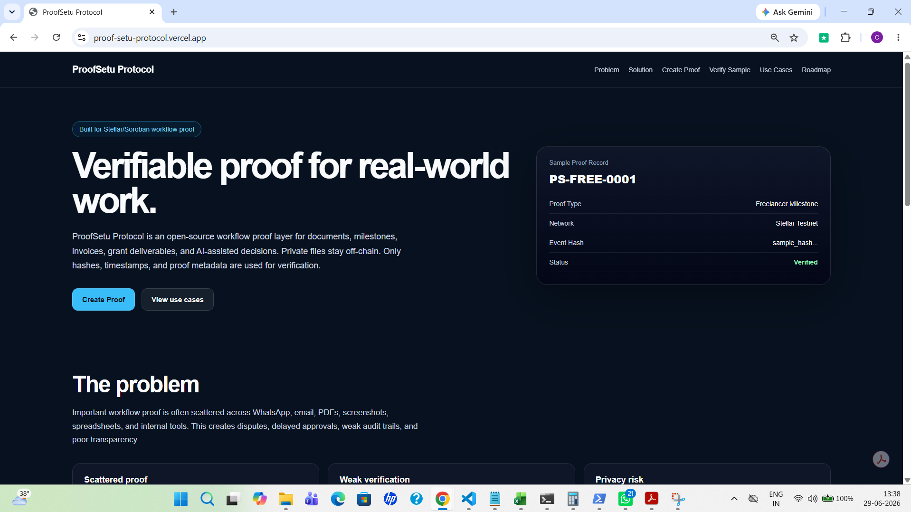
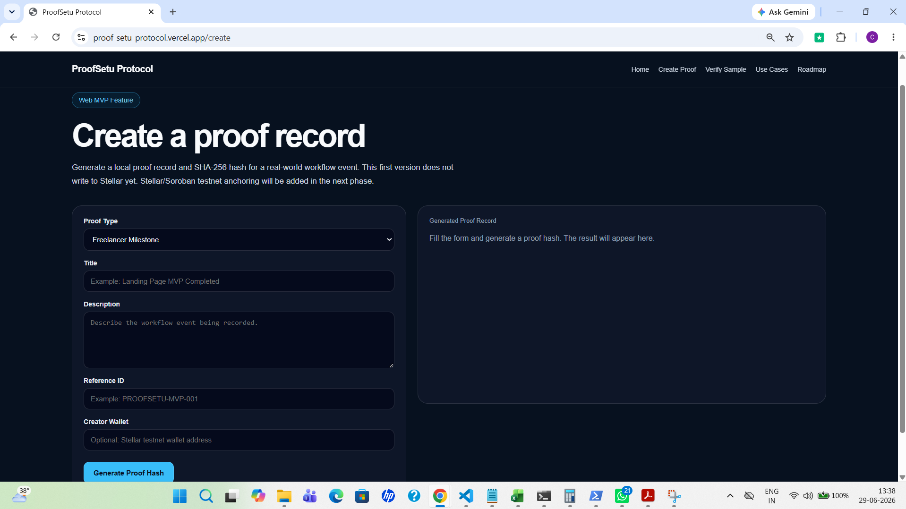
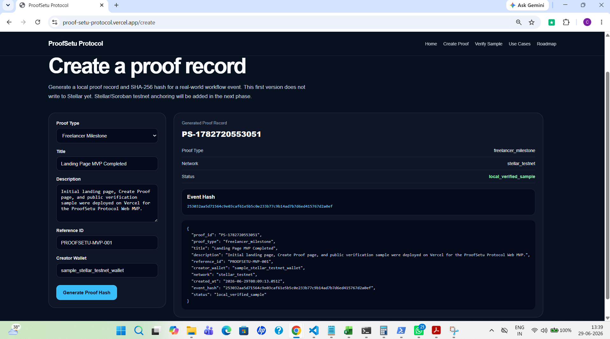
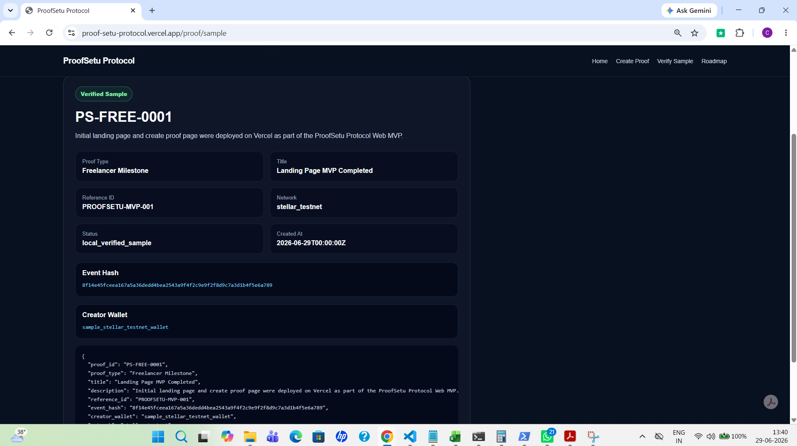
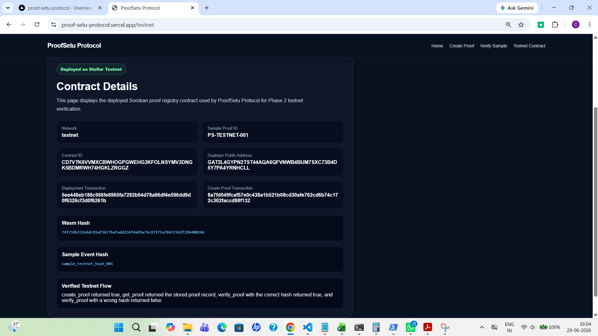
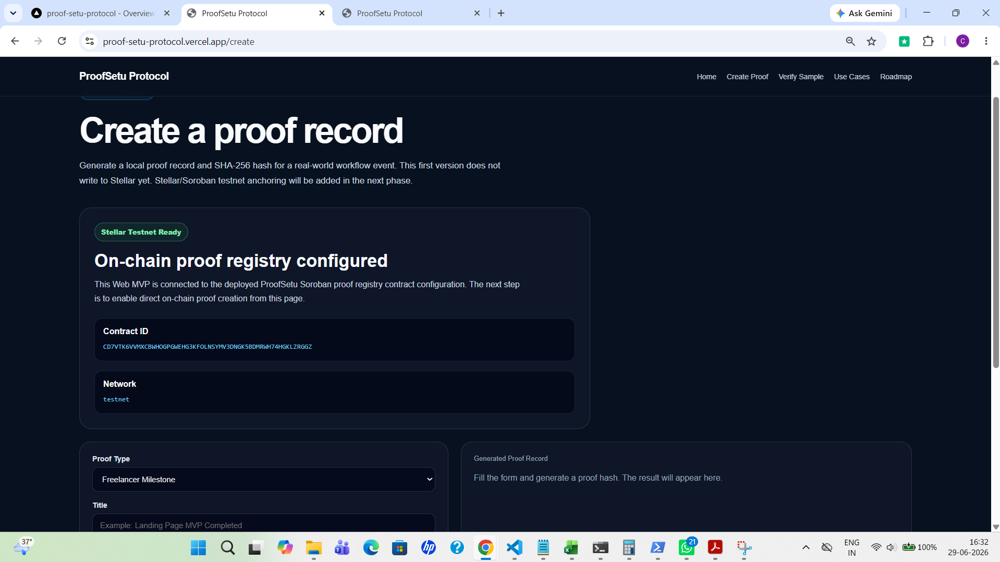
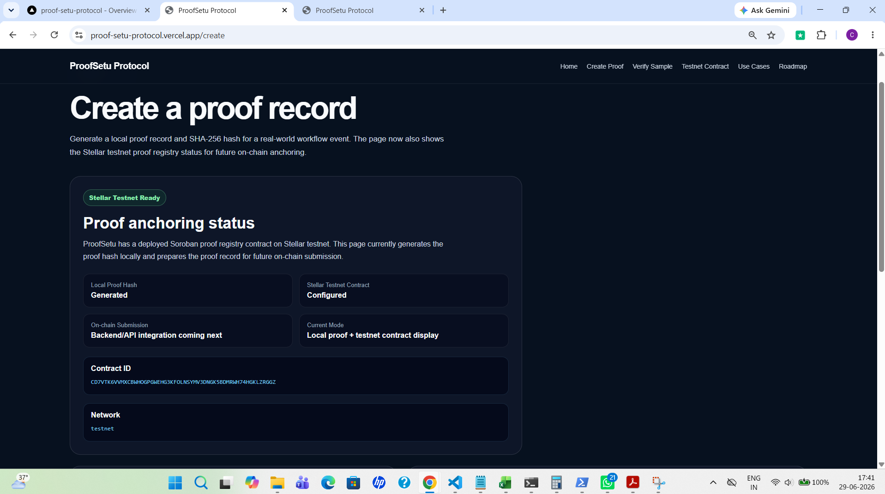
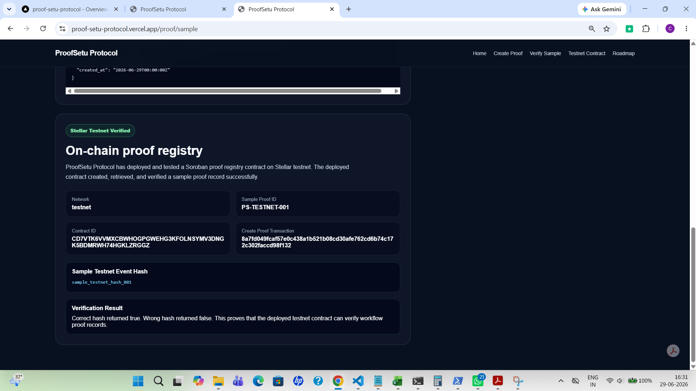
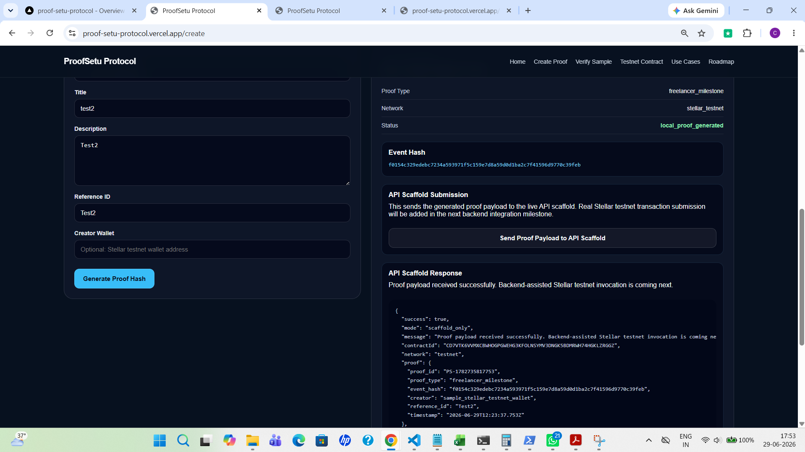
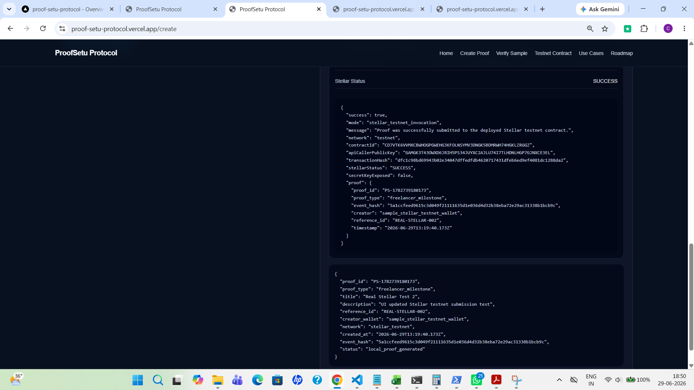

# ProofSetu Protocol

ProofSetu Protocol is an open-source verifiable workflow proof layer built on Stellar/Soroban.
## Live Demo

* Homepage: https://proof-setu-protocol.vercel.app/
* Create Proof: https://proof-setu-protocol.vercel.app/create
* Verify Sample: https://proof-setu-protocol.vercel.app/proof/sample

## Current MVP Flow

1. Visit the homepage.
2. Open the Create Proof page.
3. Enter proof details for a workflow event.
4. Generate a local SHA-256 proof hash.
5. View the generated proof record and JSON output.
6. Open the public sample verification page.

The current MVP uses local proof generation only. Stellar/Soroban testnet anchoring will be added in Phase 2.

## Problem

Important real-world work often depends on scattered proof across WhatsApp, email, PDFs, screenshots, spreadsheets, and internal tools.

This creates disputes, delays, weak auditability, and lack of trust between parties.

Examples:

* A freelancer says a milestone was completed.
* A client says an invoice was approved or not approved.
* An NGO wants to prove donation usage.
* A startup wants to prove grant deliverables.
* A hospital wants to prove that a claim document was submitted.
* An AI-assisted workflow needs an accountable decision trail.

## Solution

ProofSetu Protocol creates verifiable proof records for real-world workflow events.

Each proof record can include:

* Proof ID
* Proof type
* Event title
* Short description
* Document or event hash
* Timestamp
* Creator wallet
* Network reference
* Verification status

The long-term goal is to anchor these proof records on Stellar/Soroban so anyone can verify that an event existed at a specific time without exposing private documents.

## Why Stellar

Stellar provides fast, low-cost, open financial infrastructure suitable for real-world payment and trust workflows.

ProofSetu uses Stellar/Soroban to make workflow proof records verifiable, transparent, and ready to connect with future payment, milestone, invoice, escrow, remittance, or stablecoin settlement flows.

## MVP Scope

The first version will include:

* Landing page
* Proof creation form
* Hash generation
* Local proof registry
* Public verification page
* Example proof records
* Stellar testnet integration roadmap
* Soroban proof registry contract roadmap

## Use Cases

1. Freelancer milestone proof
2. NGO donation usage proof
3. Startup grant deliverable proof
4. Invoice approval proof
5. Hospital document submission proof
6. AI-assisted decision proof

## Stellar Testnet Deployment

ProofSetu Protocol Phase 2 includes a deployed Soroban proof registry contract on Stellar testnet.

The contract has been built, tested locally, deployed to Stellar testnet, and invoked successfully.

### Contract Details

* Network: Stellar testnet
* Contract ID: `CD7VTK6VVMXCBWHOGPGWEHG3KFOLNSYMV3DNGK5BDMRWH74HGKLZRGGZ`
* Wasm hash: `743718b322e6dc81af3677bafadd236f4a85a76c87171a7847c582f25b400166`
* Deployer public address: `GAT2L4GYPN2TST44AQA6QFVNWB4BUM7SXC73B4D5Y7PA4YRNHCLL`

### Deployment Transactions

* Deployment transaction: `5ee448eb186c966fe6965fa7282b94d78a96df4e596dd9d0f6326cf3d0f6261b`
* Create proof transaction: `8a7fd049fcaf57e0c438a1b521b08cd30afe762cd6b74c172c302faccd98f132`

### Verified Testnet Flow

The deployed contract was tested successfully with a sample proof record.

* `create_proof` returned `true`
* `get_proof` returned the stored proof record
* `verify_proof` with correct hash returned `true`
* `verify_proof` with wrong hash returned `false`

Sample proof ID:

`PS-TESTNET-001`

Correct hash:

`sample_testnet_hash_001`

This confirms that ProofSetu Protocol can create, retrieve, and verify workflow proof records on Stellar testnet.

## Documentation

* [Grant Proposal](docs/GRANT_PROPOSAL.md)
* [Milestones](docs/MILESTONES.md)
* [Architecture](docs/ARCHITECTURE.md)
* [Use Cases](docs/USE_CASES.md)
* [Roadmap](docs/ROADMAP.md)
* [Deployment Guide](docs/DEPLOYMENT.md)
* [Project Status](PROJECT_STATUS.md)
* [Demo Walkthrough](docs/DEMO_WALKTHROUGH.md)
* [Grant Readiness](docs/GRANT_READINESS.md)
* [Phase 2 Stellar Plan](docs/PHASE_2_STELLAR_PLAN.md)
* [Soroban Contract Design](docs/SOROBAN_CONTRACT_DESIGN.md)

## Example Proof Records

* [Freelancer Milestone Proof](examples/freelancer-milestone-proof.json)
* [NGO Donation Usage Proof](examples/ngo-donation-proof.json)
* [Hospital Document Submission Proof](examples/hospital-document-proof.json)

## Current Status

ProofSetu Protocol is currently in the repository setup and documentation stage.

Next planned step: build the first web MVP with proof creation, hash generation, and public verification pages.
## Screenshots

### Homepage

### Create Proof Page

### Generated Proof Hash

### Sample Verification Page

### Stellar Testnet Contract Page

### Create Proof Page with Stellar Config

### Create Proof On-chain Placeholder

### Verify Sample Page with Stellar Section

### Create Proof API Scaffold Response

### Create Proof Stellar Testnet Success

## License

MIT
